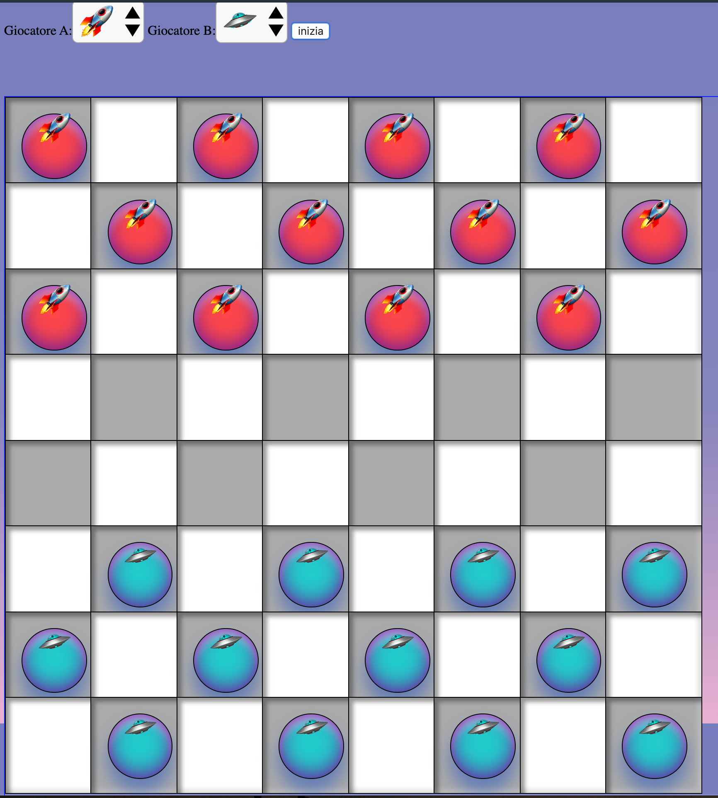

# dama-js

Draughts / checkers game.

It's a simple version of *draughts game*; in Italian it's called "dama".

All the game and graphics is in one html file (html, css & javascript).

## features

- Compatiblity with most recent versions of Firefox, Chrome, Opera and Safari
- Responsive design: you can use it on a PC, tablet, mac or TV
- succesfully tested on Amazon FireStick

## missing features

- It's only for two real players (no *CPU player*)
- no *huffing rule*

## create your own version

Look at the source: you can easily change the design and animations: it's all defined inside a *style* tag,
and change the sentences displayed at the end of each checker capture (defined in *frasi_mangio*).
